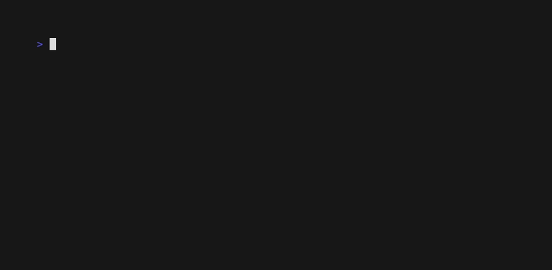
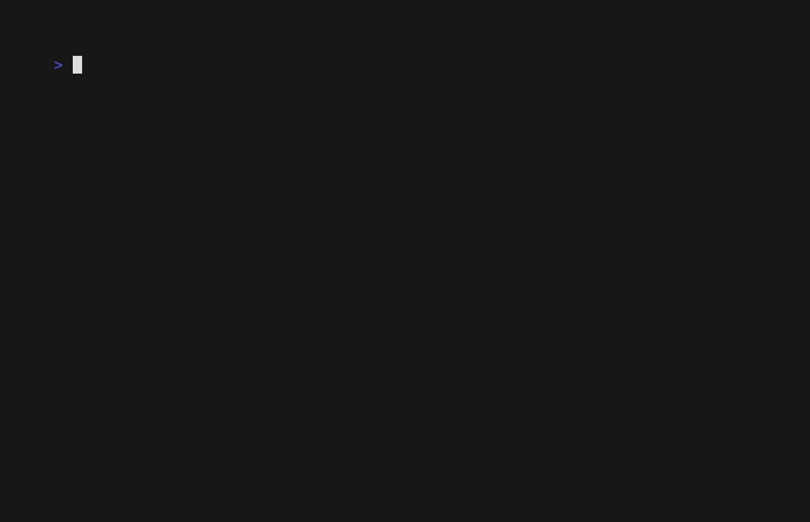

# Command line

The `veridelta` command runs a comparison, checks a configuration, proposes value maps and other rules, prints the JSON Schemas of its files and its output, and serves its checks and comparisons to an AI agent. `run`, `validate`, `crosswalk`, and `suggest` read `veridelta.yaml` unless `-c` names another file.

| Command | Description |
| :--- | :--- |
| `veridelta run` | Compare the two datasets and report the result. |
| `veridelta validate` | Report what would stop a run, without reading any rows. |
| `veridelta crosswalk` | Propose `value_map` entries from the data. |
| `veridelta suggest` | Suggest rules that would explain the differences, each with its evidence. |
| `veridelta schema` | Print the JSON Schema of the configuration file, or of what a command prints with `--json`. |
| `veridelta mcp` | Serve checks and comparisons to an AI agent as Model Context Protocol tools, over stdio. |
| `veridelta --version` | Print the installed version. |

## Running a comparison

`veridelta run` compares the configured datasets, prints a report, and exits with a [status code](#exit-codes):

```bash
veridelta run -c veridelta.yaml
veridelta run -c veridelta.yaml --json
veridelta run -c veridelta.yaml --html report.html --markdown summary.md --otel otel-metrics.json
```

| Flag | Description |
| :--- | :--- |
| `-c`, `--config PATH` | Configuration file. Default `veridelta.yaml`. |
| `-v`, `--verbose` | Print each file opened, connection, read, and pushdown statement on stderr; see [Logging](#logging). |
| `--json` | Print the [summary](results.md#summary) as JSON on stdout instead of the text report. |
| `-q`, `--quiet` | Suppress progress messages on stderr. The report or the JSON still prints. |
| `--baseline PATH` | Accept the drift the JSON file lists, and fail only on drift it does not list. See [Accepting drift](#accepting-drift). |
| `--save-baseline PATH` | Also write the drift this run finds as the file `--baseline` reads. |
| `--html PATH` | Also write a standalone [HTML report](results.md#html-report), which loads nothing from a CDN. |
| `--html-max-rows N` | Rows per table in the HTML report, zero or more. Default 1000, so a large diff cannot produce a file too large to open. |
| `--markdown PATH` | Also write the [Markdown summary](results.md#markdown-summary) that the [CI integrations](ci.md) post. |
| `--markdown-max-rows N` | Changed values to list in the Markdown summary, lowest keys first. Default 0, which lists none. |
| `--otel PATH` | Also write the run's [OpenTelemetry metrics](results.md#opentelemetry-metrics) to a file. |
| `--otel-send` | Also send the metrics to an OTLP/HTTP endpoint. See [Sending to an endpoint](results.md#sending-to-an-endpoint). |

Progress messages always go to stderr, so `veridelta run --json | jq` needs no filtering. Reports and summaries from a pushdown run are labeled as holding primary keys only. An HTML report shows a [row sample](pushdown.md#row-samples)'s values when the run fetched one, and so does a Markdown summary that lists values.

## Exit codes

Every command exits `2` for invalid arguments. Every command but `schema`, which only prints, exits `3` when it cannot finish:

| Code | `run` | `validate` | `crosswalk` | `suggest` | `mcp` |
| :--- | :--- | :--- | :--- | :--- | :--- |
| `0` | A match within `threshold`. | No errors. Warnings are allowed. | Proposals computed, whether or not any were found. | Suggestions computed, whether or not any were found. | The host disconnected, or Ctrl-C stopped the server. |
| `1` | Drift. | At least one error. | Not used. | Not used. | Not used. |
| `2` | Invalid arguments. | Invalid arguments. | Invalid arguments. | Invalid arguments. | Invalid arguments, such as a `--root` that is not a directory. |
| `3` | The run could not finish, such as on a configuration error, an unreachable source, a missing extra, or metrics `--otel-send` could not send. | The check could not finish, such as when `--schemas` cannot reach a source. | The proposals could not be computed. | The suggestions could not be computed, such as for a pair compared where it is stored. | The server could not start, such as without the `mcp` extra. |

A command that cannot finish explains why on stderr. With `--json`, it also prints the error on stdout, as one JSON object in place of its usual output:

```json
{
  "error": {
    "type": "ConfigError",
    "message": "Environment variable 'SNOWFLAKE_PASSWORD' is not set, but source -> password references it. Set it, or write ${NAME:-default} to give a fallback."
  }
}
```

`type` names the error. A `ConfigError` is a problem with the configuration file. A `ConnectorError` comes from a source, or from the endpoint `--otel-send` posts to. A `DataIntegrityError` comes from a source's data. Any other type is a bug or an unsupported input: please [report it](https://github.com/Veridelta/veridelta/issues). An error `validate` finds in the file is a finding at exit `1`, in its usual output, not an error object.

`veridelta schema error` prints the JSON Schema of this object; see [Printing the schema](#printing-the-schema).

## Logging

`-v` or `--verbose` prints Veridelta's own log lines on stderr, for `run`, `validate`, `crosswalk`, and `mcp`. Each line records a file opened, a connection, a read, or a pushdown statement. Reads and statements carry their timings:

```text
INFO veridelta.connectors.database: Read 1200 rows of table 'orders' from postgresql://analyst@db.internal/sales in 0.412s
```

A line names its source by host, account, project, database, or table, and masks a password inside a URI. It never holds SQL text, row values, or a credential. [Logging](sources.md#logging) lists what each level records. The drivers' own loggers stay silent.

When a read or a statement fails, a warning names it and how long it ran, and the error follows. `--verbose` changes nothing else: stdout keeps the report or the JSON, and `--quiet` still drops the progress messages.

## Checking a configuration

`veridelta validate` reports what would stop a run, without reading any rows:

```bash
veridelta validate -c veridelta.yaml
veridelta validate -c veridelta.yaml --allow-missing-env --json
veridelta validate -c veridelta.yaml --schemas
```

| Flag | Description |
| :--- | :--- |
| `-c`, `--config PATH` | Configuration file. Default `veridelta.yaml`. |
| `-v`, `--verbose` | Print each file opened, connection, read, and pushdown statement on stderr; see [Logging](#logging). |
| `--schemas` | Also connect, read each side's columns, never its rows, and check the rules against them. |
| `--allow-missing-env` | Read an unset `${NAME}` as the text `NAME`, with a warning, instead of failing. |
| `--json` | Print the findings as one JSON object on stdout. |
| `-q`, `--quiet` | Suppress the verdict line on stderr. |

By default, `validate` connects to nothing. It checks that:

- the source and target are a pair an engine can compare;
- every optional extra the run needs is installed, in the environment `validate` runs in;
- a database `table` uses a URI scheme Veridelta can quote;
- each `regex_replace` pattern compiles in Polars, whose regular expressions have no look-around and no backreferences, unlike Python's `re`.

On a pair compared in place, such as two warehouse tables, it also warns about settings the backend refuses only for some stored names or types:

- `normalize_column_names`;
- `min_jaro_winkler_similarity`;
- a `datetime_format` the backend cannot parse with, such as any `datetime_format` on Postgres;
- `max_levenshtein_distance` on Postgres and DuckDB;
- a `regex_replace` replacement that refers to a group by name.

A pattern Polars rejects is only a warning there, since the backend runs it with its own engine.

With `--schemas`, `validate` also connects and checks the rules against each side's columns:

- Files and lakehouse tables are opened as a run opens them, then checked with `DiffEngine.validate_rules`. JSON, Excel, and Avro files have no lazy reader, so they are read whole.
- A database `table` is read as a run reads it, with `WHERE 1 = 0` added, so no row is fetched. SQLite reports a `NUMERIC` column as text in that probe, although a full read returns numbers. A `query` is not run. If either side reads one, the rules are checked against neither side, and a warning names each `query` side.
- A pair compared in place runs the column probes a run starts with, then compiles every comparison statement without running it. That settles each warning above one way or the other.
- A name in a rule's `column_names` that neither side has, after `normalize_column_names` when it is on, is a warning. Such a rule does nothing. That is safe, since it only fails to forgive, but a misspelled name would otherwise go unnoticed.

Errors print to stdout as `error:` lines and warnings as `warning:` lines. With `--json`, they print as one object with `config`, `valid`, `errors`, and `warnings`. The verdict goes to stderr.

<details markdown>
<summary>Watch <code>validate --schemas</code> catch a wrong primary key</summary>



```text
> cat orders.yaml
primary_keys: [order_id]
source:
  path: legacy.csv
target:
  path: modern.csv
> head -n 2 legacy.csv
id,status,amount
1,open,10.0
> veridelta validate -c orders.yaml --schemas
error: The primary key 'order_id' is not among the columns of the source, `legacy.csv` read as csv. The columns read are: 'id', 'status', 'amount'.
orders.yaml: 1 error, 0 warnings.
> echo "exit code: $?"
exit code: 1
```

</details>

`--allow-missing-env` checks a file without its secrets, such as in a pull request job. An unset `${NAME}` with no default is read as the text `NAME`, with a warning. That works for fields that take a name, such as `table`, `account`, `password`, or `path`. A field with a required shape, such as a database `uri`, still fails unless its variable is set.

In Python, `DiffEngine.check_config_file(path, schemas=False, allow_missing_env=False)` checks a file as `validate` does, and `DiffEngine.check_configs(diff, source, target, schemas=False)` checks models already loaded. Both return the findings as `ConfigFinding` models. `load_config(path, unset_env=[])` reads unset variables as their names and appends each name to the list.

## Proposing value maps

`veridelta crosswalk` prints `value_map` entries that the data supports, as YAML rules ready to paste into the configuration. [Proposing a value map](rules.md#proposing-a-value-map) explains how entries are chosen:

```bash
veridelta crosswalk -c veridelta.yaml
veridelta crosswalk -c veridelta.yaml --min-confidence 0.99 --json
```

| Flag | Description |
| :--- | :--- |
| `-c`, `--config PATH` | Configuration file. Default `veridelta.yaml`. |
| `-v`, `--verbose` | Print each file opened, connection, read, and pushdown statement on stderr; see [Logging](#logging). |
| `--min-confidence SHARE` | Share of a source value's rows that must agree on one target value, above 0.5. Default 0.95. |
| `--min-support N` | Agreeing rows an entry needs. Default 5. |
| `--sample-fraction SHARE` | Share of source rows to read, chosen by primary key. Default 1.0. |
| `--json` | Print the proposals and their evidence as JSON on stdout instead of YAML. |
| `-q`, `--quiet` | Suppress progress and evidence on stderr. |

<details markdown>
<summary>Watch <code>crosswalk</code> propose a value map</summary>



```text
> head -n 4 crm.csv
id,active,tier
1,Y,silver
2,Y,bronze
3,N,gold
> head -n 4 warehouse.csv
id,active,tier
1,true,silver
2,true,bronze
3,false,gold
> veridelta crosswalk -c crosswalk.yaml
Loading configuration from crosswalk.yaml...
Lining up source and target values...
active: 2 new value_map entries
  'Y' -> 'true': 10 of 10 rows (100.0%)
  'N' -> 'false': 5 of 5 rows (100.0%)
rules:
- column_names:
  - active
  value_map:
    Y: 'true'
    N: 'false'
```

</details>

## Suggesting rules

`veridelta suggest` runs the comparison, then suggests rules that would explain the differences it finds, each with its evidence. It prints the rules as YAML on stdout, ready to paste first in `rules`, and the evidence on stderr. No model is called:

```bash
veridelta suggest -c veridelta.yaml
veridelta suggest -c veridelta.yaml --max-share 0.001 --json
```

| Flag | Description |
| :--- | :--- |
| `-c`, `--config PATH` | Configuration file. Default `veridelta.yaml`. |
| `-v`, `--verbose` | Print each file opened, connection, read, and pushdown statement on stderr; see [Logging](#logging). |
| `--max-share SHARE` | Largest gap a tolerance may explain, as a share of the larger of its two values, above 0 and at most 1. Default 0.01. |
| `--json` | Print the suggestions and their evidence as JSON on stdout instead of YAML. |
| `-q`, `--quiet` | Suppress progress and evidence on stderr. |

A numeric column gets a tolerance when every gap between its differing values is at most `--max-share` of the larger of the two. A larger gap is a change, not noise, so that column gets no suggestion. The kind of tolerance follows the gaps:

- An absolute tolerance, when the gaps stay about one size whatever the values, as rounding leaves them.
- A relative tolerance, when the gaps grow with the values, as a rate change leaves them.

The tolerance is the first round value, such as 0.005 or 0.01, above the largest gap.

A text column gets trimming, `whitespace_mode: both`, when its differing values match once both ends are stripped, and case folding, `case_insensitive: true`, when they match once lowercased. It gets both only when some rows need both. Text that differs in anything else is a change, so no rule explains it.

A column with text on one side and dates or timestamps on the other gets `datetime_format` when the text reads as those dates under one format. The common formats are tried, such as `%Y-%m-%d`, `%d/%m/%Y`, and `%m/%d/%Y`, with or without a time, and the one that matches the most rows wins. A timestamp with a zone is left out, since text without an offset names no instant.

A column of any type gets `null_values` when a common spelling of NULL stands on one side where the other side is NULL. The spellings are an empty string, `N/A`, `NA`, `#N/A`, `NULL`, `(null)`, `<null>`, `None`, `nil`, `NaN`, `-`, `--`, and `?`, in any case, and the numbers -1, -9, -99, -999, -9999, and -99999. A suggested sentinel joins the column's sentinels today, from its rule or from `default_null_values`. A real value beside NULL, such as a city, is a change, and `false` is never suggested, since it is too often meant.

Then the comparison runs again with the rule, and the evidence counts the rows it makes match, of the rows that differ in that column, with up to three example keys, and for a tolerance, the largest gap. A row with a NULL on one side is explained only by a null sentinel. A rule that would make a row that matches today differ is not suggested, such as case folding ahead of a `value_map` whose keys are capitals.

Each printed rule names its column alone. When a rule governs the column today, such as one that matches it by `pattern`, the suggestion keeps that rule's settings, and a note says to put it first in `rules`, where it wins over the other. In Python, `DiffEngine.suggest_rules()` returns the suggestions as `RuleSuggestion` models.

`suggest` reads both sides locally, so it refuses a pair compared where it is stored, such as two warehouse tables. Suggest rules on files exported from them instead.

## Accepting drift

`veridelta run --baseline accepted.json` accepts the drift the file lists and fails only on drift it does not list, so a change made on purpose stops failing the run while any new drift still fails it:

```json
{
  "primary_keys": ["order_id"],
  "added": [{"order_id": 1121}],
  "removed": [{"order_id": 1017}],
  "changed": [{"key": {"order_id": 1034}, "columns": ["amount"]}]
}
```

`added` and `removed` list rows by their primary key. `changed` lists a row with the columns whose drift is accepted on it: drift in any other column of that row still counts. The keys are the run's `primary_keys`, as the run compares them, after any rule normalizes them. JSON has no type for a date, so a date key is written as text, such as `"2026-10-07"`, and read back as the key column's type.

Accepted drift is left out of the counts, the verdict, the artifacts, and the reports, and the summary's `accepted_count` says how many rows the file accepted. A run compared where its data is stored refuses `--baseline`, since its rows stay where they are. `veridelta schema baseline` prints the file's JSON Schema.

`veridelta run --save-baseline accepted.json` writes the file from a run, so a change made on purpose is accepted in one step: every row of drift the run finds, in key order, with each changed row's differing columns. Read the file before you commit it, since it accepts all of that drift. With `--baseline` too, the new file keeps what the old one accepted, and leaves out entries for rows that no longer drift. The run's verdict and exit code are the same as without the flag.

## Printing the schema

`veridelta schema` prints the configuration file's JSON Schema, which editors use to complete and check a file; see [Editor support](configuration.md#editor-support):

```bash
veridelta schema > veridelta.schema.json
```

Given the name of an output, it prints the JSON Schema of what a command prints with `--json` instead, so a script or an agent can check what it parses:

```bash
veridelta schema run > run.schema.json
```

| Name | The JSON it describes |
| :--- | :--- |
| `run` | The summary `veridelta run --json` prints: the row counts, the verdict, and the drifting columns. |
| `validate` | The report `veridelta validate --json` prints: whether the file is valid, its errors, and its warnings. |
| `crosswalk` | The list of value maps `veridelta crosswalk --json` proposes. |
| `suggest` | The list of rules `veridelta suggest --json` suggests, with their evidence. |
| `baseline` | The file `veridelta run --baseline` reads: the drift a run accepts. See [Accepting drift](#accepting-drift). |
| `error` | The one object `run`, `validate`, `crosswalk`, or `suggest` prints with `--json` in place of its usual output when it [exits 3](#exit-codes). |

The docs site serves each one too, at the URL its `$id` names, such as [`schema/run.schema.json`](schema/run.schema.json). A schema changes with the release that changes its output, and the changelog says so.

## Serving tools to an agent

`veridelta mcp` serves Veridelta's checks and comparisons to an AI agent as [Model Context Protocol](https://modelcontextprotocol.io/) tools. The agent's host, such as Claude Code or Cursor, starts the command and speaks to it over stdin and stdout. It needs the `mcp` extra, and [AI agents](agents.md#mcp-server) shows how to register it with a host and lists its tools. This serves the configuration files in the current directory:

```bash
veridelta mcp --root .
```

| Flag | Description |
| :--- | :--- |
| `--root DIR` | A folder the tools may read configuration files and data on this machine from. Repeat it for more folders. Default: the current directory. |
| `--allow-row-values` | Let `read_discrepancies`, `propose_value_maps`, and `suggest_rules` return values from the data. Off by default. |
| `--allow-queries` | Let a tool run a side's `query`, which runs as written. A DuckDB file still reads other files only from under the roots. Off by default. |
| `--max-rows N` | The most rows, value map entries, or example keys one call returns, at least 1. Default: 50. |
| `-v`, `--verbose` | Print each file opened, connection, read, and pushdown statement on stderr; see [Logging](#logging). |

A tool refuses a configuration file, or data on this machine, outside every root, and a tool that runs the comparison refuses a configuration whose `output_path` lies outside them. Without `--allow-row-values`, no tool returns a value from the data, and without `--allow-queries`, no tool runs a side's `query`. The server runs in the first root, so a relative path in a tool call, or in a configuration file, resolves there. Stdout carries the protocol and nothing else, and log lines go to stderr, which the host keeps. The server stops when the host disconnects, or on Ctrl-C.
