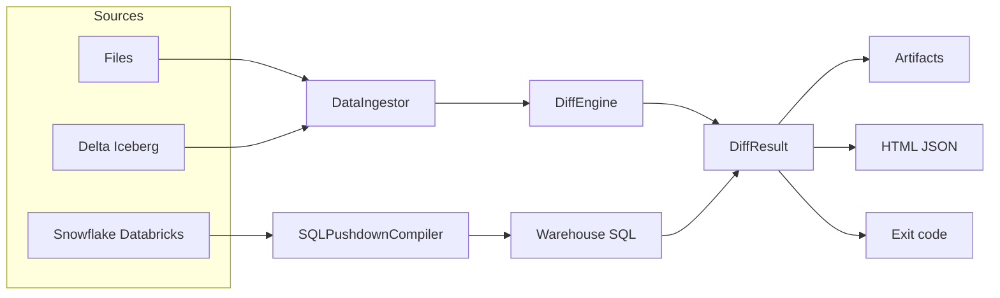

# Veridelta

Veridelta compares two datasets on their keys and reports exactly what changed after applying the variance you declared as expected. It is built for system modernizations, model retrains, and pipeline migrations — anywhere "equal" has to be defined, not assumed.

Powered by [Polars](https://pola.rs/).

## Why

- **Deterministic verdicts.** Nine fixed transform stages. The same rule produces the same result locally and in a warehouse, verified by a differential harness.
- **Scale.** Lazy Polars scans. Warehouse pushdown compiles comparison SQL and never extracts full tables.
- **Exactness.** Nothing is forgiven unless a rule says so. `strict_types` treats type drift as a mismatch, not a cast.
- **CI/CD.** Exit code 0 or 1. `--json` on stdout. `--html` writes a standalone report. Artifacts for added, removed, and changed rows.
- **Schema evolution.** `schema_mode` is `intersection`, `exact`, `allow_additions`, or `allow_removals`.
- **Connectors.** Snowflake and Databricks SQL pushdown; Delta Lake and Iceberg scans. Optional extras. See the [Configuration Guide](configuration.md) for YAML, extras, and routing.

## Install

```bash
uv add veridelta
# or: pip install veridelta
uv add 'veridelta[snowflake]'   # extras: snowflake, databricks, delta, iceberg, excel, all
```

## Architecture



File and lakehouse sources load through `DataIngestor` into a local `DiffEngine` run. Same-warehouse pairs compile to SQL and execute in place. Both paths return a `DiffResult`.

## Quick start

Python — `DiffEngine` consumes `LazyFrame`s:

```python
import polars as pl
from veridelta import DiffConfig, DiffEngine, DiffRule

result = DiffEngine(
    DiffConfig(
        primary_keys=["user_id"],
        rules=[DiffRule(pattern="^AMT_.*", absolute_tolerance=0.05)],
    ),
    pl.scan_parquet("legacy.parquet"),
    pl.scan_parquet("modern.parquet"),
).run()

if not result.summary.is_match:
    raise SystemExit(f"{result.summary.changed_count} rows differ")
```

YAML — the same comparison for CI:

```yaml
# veridelta.yaml
primary_keys: ["transaction_id"]
source:
  path: "legacy.parquet"
  format: "parquet"
target:
  path: "modern.parquet"
  format: "parquet"
rules:
  - column_names: ["grand_total"]
    relative_tolerance: 0.01
  - column_names: ["contact_number"]
    regex_replace: {"[^0-9]": ""}
```

```bash
veridelta run -c veridelta.yaml
```

Set `output_path` to write `added` / `removed` / `changed` artifacts; `output_format` selects Parquet, CSV, JSON, NDJSON, or Arrow.

## Documentation

- [**1. Core Concepts**](examples/01_core_concepts.ipynb): Python API, `DiffResult`, and rules.
- [**2. YAML and CLI**](examples/02_yaml_and_cli.ipynb): pipeline automation, `--json`, artifacts.
- [**3. Advanced Rules**](examples/03_advanced_rules.ipynb): drift resolution on real data.
- [**4. HTML Reports**](examples/04_html_reports.ipynb): audit and compliance hand-off.
- [**Configuration Guide**](configuration.md): fields, formats, extras, CLI flags, warehouse and lakehouse routing.
- [**API Reference**](api.md): public Python surface.
- [**Roadmap**](roadmap.md): work that is not built yet.
