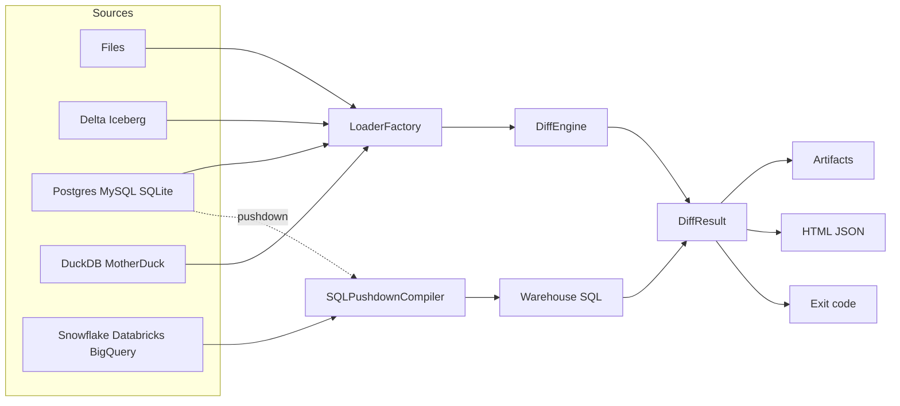

# Veridelta

Veridelta compares two datasets on their primary keys and reports every row that differs once the rules you declare are applied. Use it to verify a system migration, a model retrain, or a pipeline change.

Files, lakehouse tables, databases, and DuckDB files are read and compared on [Polars](https://pola.rs/). Two tables in one warehouse are compared inside it, and only counts and keys come back.

## Install

```bash
uv add veridelta                # or: pip install veridelta
uv add 'veridelta[snowflake]'   # extras: snowflake, databricks, bigquery, delta, iceberg, database, duckdb, excel, fuzzy, all
```

## Where to start

The tutorials build a comparison step by step:

1. [Core concepts](examples/01_core_concepts.ipynb): the Python API, `DiffResult`, and rules.
2. [YAML and CLI](examples/02_yaml_and_cli.ipynb): a configuration file, `--json`, and artifacts.
3. [Advanced rules](examples/03_advanced_rules.ipynb): resolving drift in real data.
4. [HTML reports](examples/04_html_reports.ipynb): a report to hand to reviewers.
5. [Validate and CI](examples/05_validate_and_ci.ipynb): a database source, `veridelta validate`, and the GitHub Action.

The user guide is the reference:

- [Configuration](configuration.md): the file, its settings, and environment variables.
- [Sources](sources.md): files, lakehouse tables, databases, DuckDB, and warehouses.
- [Rules](rules.md): what counts as a match, column by column.
- [Pushdown](pushdown.md): comparing two tables inside the warehouse that stores them.
- [Results](results.md): the summary, reports, metrics, and files a run produces.
- [Command line](cli.md): commands, flags, and exit codes.
- [CI integrations](ci.md): the GitHub Action and the GitLab CI template.

## How it works


```mermaid
flowchart LR
  subgraph sources [Sources]
    files[Files]
    lakehouse[Delta Iceberg]
    databases[Postgres MySQL SQLite]
    duckdb[DuckDB MotherDuck]
    warehouse[Snowflake Databricks BigQuery]
  end
  files --> loader[LoaderFactory]
  lakehouse --> loader
  databases --> loader
  duckdb --> loader
  warehouse --> compiler[SQLPushdownCompiler]
  databases -. pushdown .-> compiler
  loader --> engine["DiffEngine"]
  engine --> result[DiffResult]
  compiler --> warehouseSql[Warehouse SQL]
  warehouseSql --> result
  result --> artifacts[Artifacts]
  result --> reports["HTML JSON"]
  result --> exitCode[Exit code]
```

File, lakehouse, database, and DuckDB sources load through `LoaderFactory` into a local `DiffEngine` run. A pair of tables in one warehouse, or two Postgres tables that set `pushdown`, compiles to SQL and runs in place. Both paths return a `DiffResult`.
