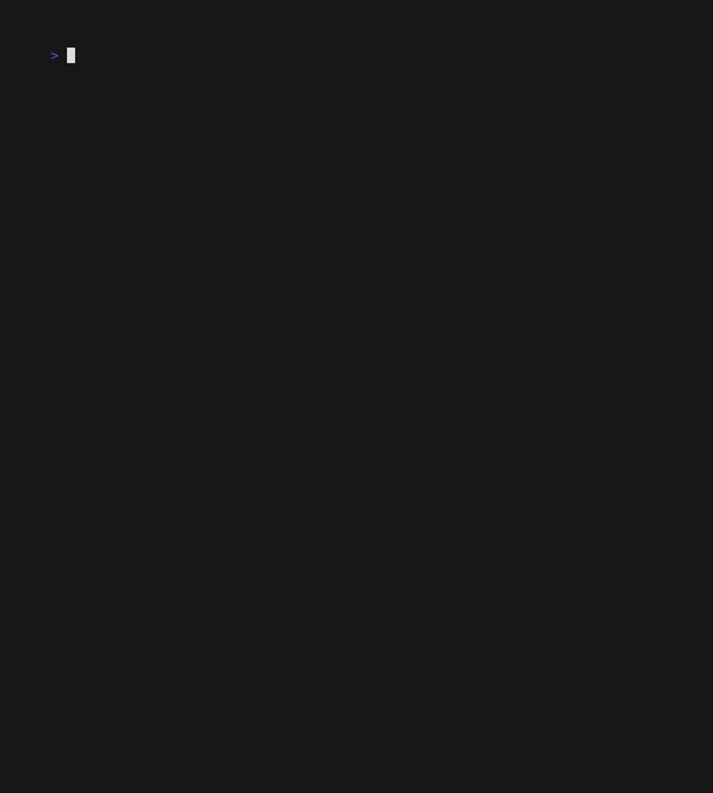
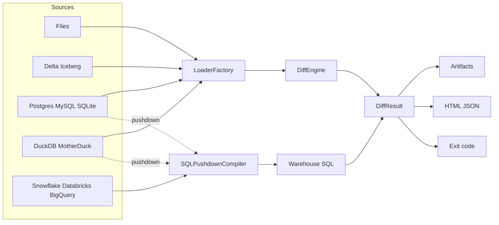

# Veridelta

Veridelta compares two datasets on their primary keys and reports every row that differs under the rules you declare. Nothing is forgiven unless a rule says so, and the exit code tells CI whether the datasets match. Use it to verify a migration, a pipeline change, or a model's new evaluation run, on a laptop, in CI, or inside a warehouse.



Files, lakehouse tables, databases, and DuckDB files are read and compared on [Polars](https://pola.rs/). Two tables in one warehouse are compared inside it, as are two Postgres or DuckDB tables that set `pushdown`. Only counts and keys come back, unless [`pushdown_sample_rows`](pushdown.md#row-samples) asks for a sample of the changed rows.

## Install

```bash
uv add veridelta                # or: pip install veridelta
uv add 'veridelta[snowflake]'   # extras: snowflake, databricks, bigquery, delta, iceberg, database, duckdb, excel, fuzzy, mcp, all
```

## Quick start

The smallest configuration names the two files and the keys that pair their rows. The suffix of each path says what format it is, and the recording above runs this file on two three-row files:

```yaml
# veridelta.yaml
primary_keys: [id]
source:
  path: legacy.csv
target:
  path: modern.csv
```

`validate` checks the file without reading any rows, and `run` compares the two files. It exits 0 when they match, 1 when rows differ, and 3 when the run could not finish. [Command line](cli.md) lists every code and flag:

```bash
veridelta validate -c veridelta.yaml
veridelta run -c veridelta.yaml
```

Two files that need no rules need no configuration file either. Name them and the key that pairs their rows, and each format still follows its suffix:

```bash
veridelta run legacy.csv modern.csv --key id
```

[Configuration](configuration.md) lists every setting, and [Rules](rules.md) say what counts as a match, column by column.

## Where to start

The tutorials build a comparison step by step:

1. [Core concepts](examples/01_core_concepts.ipynb): the Python API, `DiffResult`, and rules.
2. [YAML and CLI](examples/02_yaml_and_cli.ipynb): a configuration file, `--json`, and artifacts.
3. [Advanced rules](examples/03_advanced_rules.ipynb): resolving drift in real data.
4. [HTML reports](examples/04_html_reports.ipynb): a report to hand to reviewers.
5. [Validate and CI](examples/05_validate_and_ci.ipynb): a database source, `veridelta validate`, and the GitHub Action.
6. [Model evaluation runs](examples/06_model_evaluation_runs.ipynb): two runs of a model's evaluation, compared on the example ID, with a tolerance on scores and fuzzy matching on answers.

The user guide is the reference:

- [Configuration](configuration.md): the file, its settings, and environment variables.
- [Sources](sources.md): files, lakehouse tables, databases, DuckDB, and warehouses.
- [Rules](rules.md): what counts as a match, column by column.
- [Pushdown](pushdown.md): comparing two tables inside the warehouse that stores them.
- [Results](results.md): the summary, reports, metrics, and files a run produces.
- [Command line](cli.md): commands, flags, and exit codes.
- [CI integrations](ci.md): the GitHub Action and the GitLab CI template.
- [AI agents](agents.md): running Veridelta from an agent, through the command line or the MCP server.

## How it works


```mermaid
flowchart LR
  subgraph sources [Sources]
    files[Files]
    lakehouse[Delta Iceberg]
    databases[Postgres MySQL SQLite]
    duckdb[DuckDB MotherDuck]
    warehouse[Snowflake Databricks BigQuery]
  end
  files --> loader[LoaderFactory]
  lakehouse --> loader
  databases --> loader
  duckdb --> loader
  warehouse --> compiler[SQLPushdownCompiler]
  databases -. pushdown .-> compiler
  duckdb -. pushdown .-> compiler
  loader --> engine["DiffEngine"]
  engine --> result[DiffResult]
  compiler --> warehouseSql[Warehouse SQL]
  warehouseSql --> result
  result --> artifacts[Artifacts]
  result --> reports["HTML JSON"]
  result --> exitCode[Exit code]
```

File, lakehouse, database, and DuckDB sources load through `LoaderFactory` into a local `DiffEngine` run. A pair of tables in one warehouse, or two Postgres or DuckDB tables that set `pushdown`, compiles to SQL and runs in place. Both paths return a `DiffResult`.
